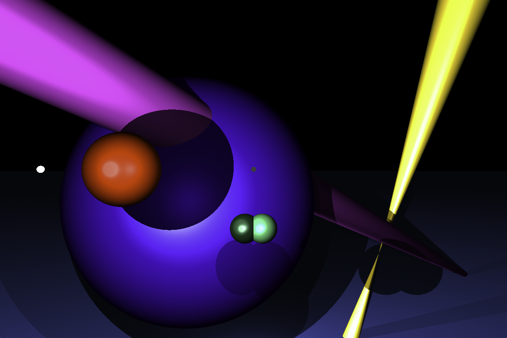

# rtv1

## Description

Le but de ce projet est de créer un raytracer basique



## Installation

``` bash
$> git clone https://github.com/bmoiroud/rtv1.git && cd rtv1 && make
```

## Utilisation

``` bash
$> ./rtv1 <scene>
```

| Touche  | Action             |
|:-------:|:-------------------|
| W       | avancer            |
| A       | gauche             |
| S       | reculer            |
| D       | droite             |
| Q       | rotation à gauche  |
| E       | rotation à droite  |
| Espace  | monter             |
| CTRL    | descendre          |
| esc     | quitter            |
